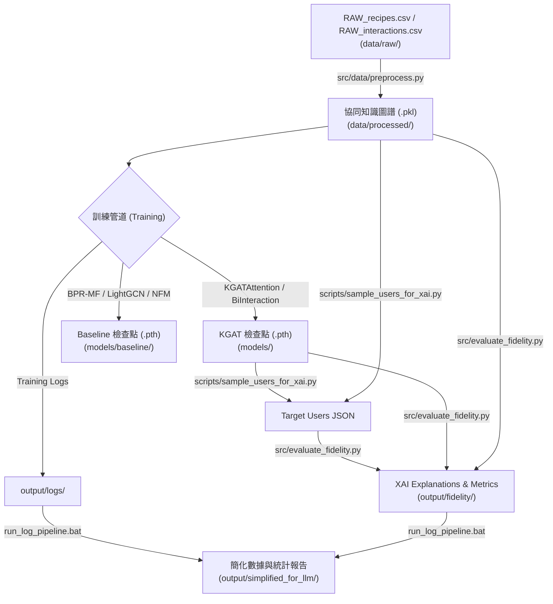

# 食譜推薦系統 - Knowledge Graph Attention Network 消融與 XAI 實驗套件 (Recipe-Recommendation-KGAT)

[](https://www.python.org/)
[](https://pytorch.org/)
[](https://github.com/astral-sh/uv)
[](LICENSE)

本專案是一個基於 **知識圖譜注意力網絡 (Knowledge Graph Attention Network, KGAT)** 的深層食譜推薦與可解釋性 AI (XAI) 實驗系統。專案整合 Food.com 巨量食譜與使用者互動數據，建構協同知識圖譜 (Collaborative Knowledge Graph, CKG)，並透過原生 PyTorch XPU 硬體加速、BFloat16 混合精度與 Activation Checkpointing 克服深層圖神經網路訓練的記憶體瓶頸。

此外，專案提供完整的**消融實驗套件 (Ablation Study)**、**經典對照組模型 (Baselines)**，以及基於 **Fidelity (Fid+, Fid-)** 的可解释性評估與路徑萃取框架。

---

## 🌟 核心特色 (Key Features)

* **協同知識圖譜 (Collaborative Knowledge Graph, CKG)**：自動解析 Food.com 數據，過濾無鑑別力的高頻食材與泛用標籤，將 User, Recipe (Item), Ingredient, Tag 統合成多關係圖結構。
* **原生 PyTorch XPU 硬體加速 & 效能最佳化**：
  * 支持 Intel Arc GPU / XPU 原生加速與 BFloat16 混合精度。
  * 引入 `index_add_` 原子聚合與浮點退避策略，解決高頻超級節點訊息聚合的效能退化。
  * 整合 PyTorch `checkpoint` 梯度重算技術，支援 $L=3$ 以上的深層圖網路訓練。
  * 實作 `get_final_embeddings()` 隱含向量快取推論，評估階段速度提升數十倍。
* **關係感知注意力 (Relation-Aware Attention)**：實作 $\pi(h,r,t) = (W_{\text{att}} e_t)^\top \tanh(W_{\text{att}} e_h + e_r)$ 邊權重 Softmax，精確量化不同關係邊（如：食譜-食材 vs. 食譜-標籤）之貢獻。
* **全自動化實驗管道 (Automated Pipelines)**：提供 Windows `.bat` 批次腳本，一鍵啟動 KGAT 消融實驗、Baseline 比較、XAI Fidelity 評估與日誌簡化分析。
* **可解釋性評估 (XAI & Fidelity Metrics)**：實作 `Fidelity+` (必要性) 與 `Fidelity-` (充分性) 評估指標，自動擷取使用者 Top-K 推薦背後的最優解釋路徑。

---

## 🏗️ 系統架構與數據流 (System Architecture)



---

## ⚡ 快速開始 (Quick Start)

### 1. 環境設定 (Environment Setup)

本專案推薦採用 [`uv`](https://github.com/astral-sh/uv) 進行高速依賴解析與虛擬環境管理：

```bash
# 複製專案
git clone https://github.com/AeschyJ/Recipe-Recommendation-KGAT.git
cd Recipe-Recommendation-KGAT

# 透過 uv 安裝虛擬環境與所有依賴
uv sync
```

> **Note**: 本專案使用 PyTorch 原生 XPU 支援（PyTorch 2.4+ / 2.9+），若在 Intel Arc 設備執行，請確保系統已安裝 Intel OneAPI / GPU 驅動。

### 2. 資料準備與圖譜預處理 (Data Preprocessing)

請將 Kaggle 原始檔案 `RAW_recipes.csv` 與 `RAW_interactions.csv` 放置於 `data/raw/` 目錄下，然後執行預處理腳本：

```bash
uv run python src/data/preprocess.py
```
*預處理結果將自動儲存至 `data/processed/interactions.pkl`, `kg_triples.pkl`, `stats.pkl`*

---

## 🚀 自動化實驗管道 (Execution Pipelines)

專案封裝了一系列標準化的 Windows 批次腳本 (`.bat`)：

### 1. 主 KGAT 消融實驗 (Ablation Experiments)
一鍵排程 5 組對照組實驗 (Full KGAT $L=1$, w/o Attention, w/o KG, Depth $L=2$, Depth $L=3$)：
```powershell
.\run_experiments.bat
```

### 2. 經典 Baseline 模型實驗 (Baseline Benchmark)
一鍵啟動 BPR-MF, LightGCN 與 NFM 三款經典推薦模型訓練：
```powershell
.\run_baseline_experiments.bat
```

### 3. 可解釋性評估管道 (XAI & Fidelity Pipeline)
單一模型 XAI Fidelity 評估：
```powershell
.\run_xai_pipeline.bat
```
跨模型全自動 500 位使用者 Fidelity 評估 (L=1, L=2, L=3)：
```powershell
.\run_xai_pipeline_all.bat
```

### 4. 日誌與數據整理管道 (Log Pipeline)
清理訓練日誌、驗證數據並產出最優指標簡報：
```powershell
.\run_log_pipeline.bat
```

---

## 💻 獨立命令列指令 (CLI Usages)

若欲手動呼叫各模組進行獨立訓練或評估：

```bash
# 1. 訓練 Full KGAT (L=1, BFloat16)
uv run python src/train.py --layers 64 --epochs 30 --use_bf16 --model_dir models/full_kgat

# 2. 訓練深層 KGAT (L=3, 啟用 Activation Checkpointing)
uv run python src/train.py --layers 64 64 64 --epochs 30 --use_bf16 --model_dir models/depth_3

# 3. 獨立訓練 LightGCN Baseline
uv run python src/train_baseline.py --model LightGCN --epochs 30 --model_dir models/baseline

# 4. 批次評估所有檢查點 metrics (HR@K, NDCG@K, Precision@K)
uv run python scripts/evaluate_all.py

# 5. 手動執行單一 Checkpoint 的 Fidelity 評估
uv run python src/evaluate_fidelity.py --model_path models/full_kgat/kgat_checkpoint_e30.pth --user_ids_file data/user_test_list.json --output_explain output/fidelity/explanations.json --output_metrics output/fidelity/metrics.json
```

---

## 📊 評估指標 (Evaluation Metrics)

| 指標類別 | 指標名稱 | 說明 |
| :--- | :--- | :--- |
| **推薦效能 (Accuracy)** | **HR@K** (Recall) | Top-K 推薦列表中命中真實互動項目的比率 |
| | **NDCG@K** | 考量推薦排名位置順序折扣之累積增益 |
| | **Precision@K** | Top-K 推薦結果中目標食譜的精準度 |
| **可解釋性 (Explainability)** | **Fidelity+** | **必要性驗證**：遮擋 Top-K 解釋路徑後模型分數的下降幅 (越高代表越必要) |
| | **Fidelity-** | **充分性驗證**：僅保留 Top-K 解釋路徑時與原始預測的降幅 (越接近 0 代表越充分) |

---

## 📂 專案目錄結構 (Directory Structure)

```
Experiment/
├── pyproject.toml              # uv 套件與 Python 專案配置
├── README.md                   # 專案說明主文件
├── CHANGELOG.md                # 版本修訂紀錄
├── .gitignore                  # Git 版本控制忽略清單 (已排除 4GB 大檔與建置產物)
├── data/
│   ├── raw/                    # 原始 CSV 資料 (RAW_recipes.csv, RAW_interactions.csv)
│   └── processed/              # 協同知識圖譜 (.pkl 檔)
├── docs/                       # 技術文檔、API 參考與 ADR 決策紀錄
│   ├── architecture.md         # 系統架構設計與優化細節
│   ├── api_reference.md        # 各模組與類別 API 規格說明
│   ├── development.md          # 開發者指南與維護腳本手冊
│   ├── data_dictionary.md      # 資料欄位與 CKG Schema 字典
│   └── adr/                    # Architecture Decision Records (ADR-001 ~ ADR-007)
├── models/                     # 訓練檢查點存放區 (MODELS.md 紀錄細節)
├── output/                     # 輸出日誌、Fidelity 結果與 LLM 簡化資料
├── scripts/                    # 實驗數據分析、檢查點維護與視覺化腳本
├── src/                        # 核心原始碼
│   ├── data/preprocess.py      # 圖譜前處理與特徵抽取
│   ├── model/                  # KGAT, Baselines (BPR-MF, LightGCN, NFM) 與 Explainers
│   ├── train.py                # 主 KGAT 訓練與消融進入點
│   ├── train_baseline.py       # Baseline 模型訓練進入點
│   └── evaluate_fidelity.py    # XAI Fidelity+ / Fidelity- 量化計算
└── run_*.bat                   # 各自動化實驗與評估批次檔
```

---

## 📚 延伸技術文檔 (Documentation Index)

詳細的系統架構與模組設計手冊請參閱 `docs/`：
* [專案實驗架構與模組設計](docs/architecture.md)
* [API 參考文件](docs/api_reference.md)
* [開發者指南與維護腳本說明](docs/development.md)
* [資料字典與 CKG 結構說明](docs/data_dictionary.md)
* [架構決策紀錄 (ADR Index)](docs/adr/README.md)

---

## 📜 授權條款 (License)

本專案採用 MIT License 授權條款，詳情請參閱 [LICENSE](LICENSE) 檔案。
